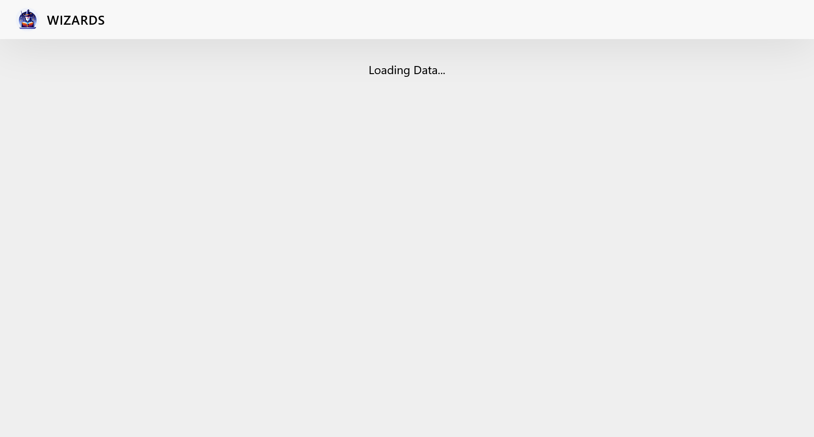
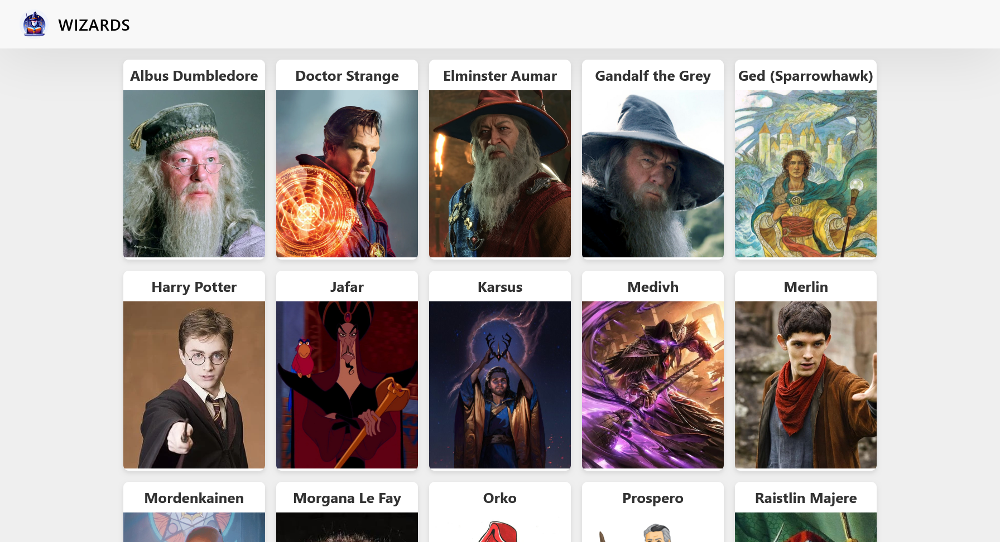
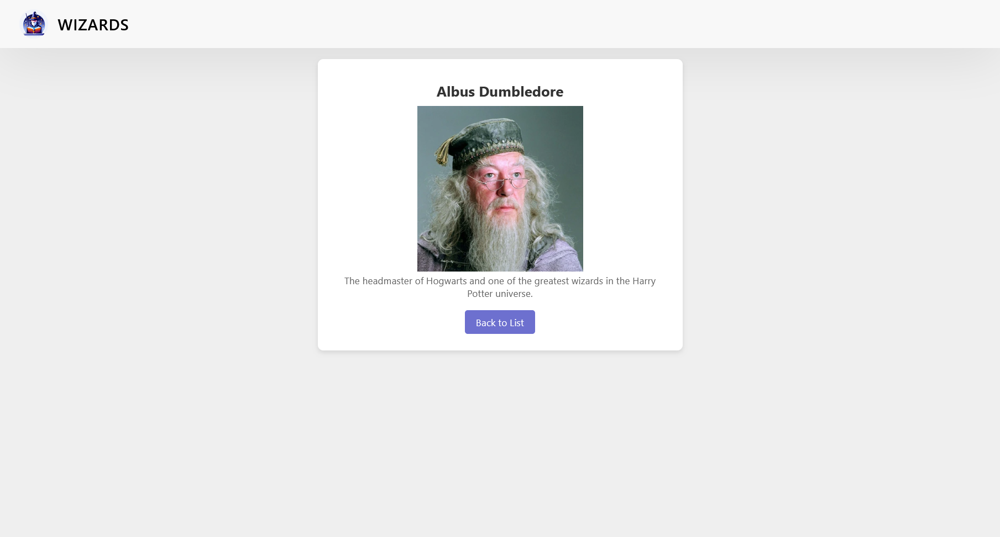
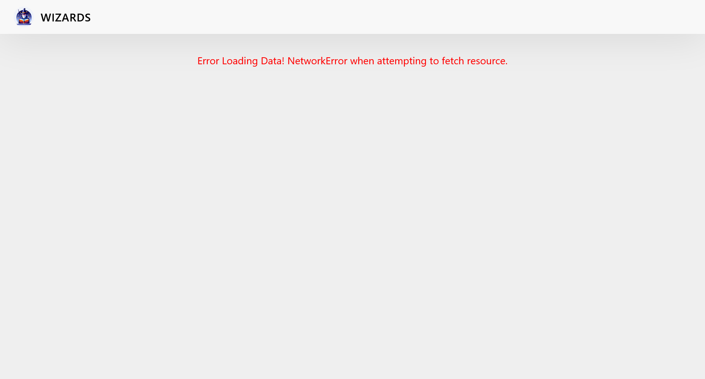
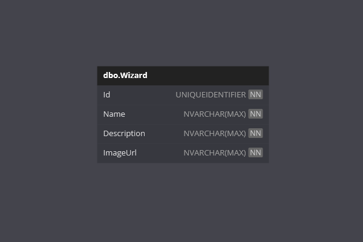

# Wizards

Welcome to the **Wizards** App!

This is a project designed to demonstrate combining a .NET Web API with a React frontend. 

It allows users to view a list of wizards from an external API and select one to view more details!

## Requirements

- [x] This is an application where you should present data coming from a .NET WebAPI using React.
- [x] Your application can only have GET requests.
- [x] You cannot use AXIOS to fetch the data, you have to use JS Fetch API
- [x] You should create an API of your choice, with a model representing a single table.
- [x] One of the properties of your API's model should be imageUrl, with a link to pictures that will be shown by the react app.
- [x] You can choose whatever ORM you want: Dapper, EF, ADO.NET.
- [x] Your app needs to have a list of records and a page to visualise an individual record.
- [x] Your app should show a 'Loading Data...' message while the request hasn't been completed.
- [x] If there's a server error, the user should be informed.

## Features

- **Loading**: When the frontend application starts, it will show a Loading Data message.
- **Error**: If there is an error when fetching the api data, it will show an Error message.
- **List View**: When the api data has been fetched, a list of Wizards will be displayed.
- **Detail View**: Users can click a Wizard to view more details.
- **Responsive Design**: A user-friendly interface designed to work on various devices.
- **API Methods**: Get methods are exposed within the api application.
- **Database Seeding**: When the backend application start, it will create a database if required and inserts some initial data.

## Technologies

- .NET
- React
- CSS
- JavaScript
- Entity Framework Core
- SQL Server

## Getting Started

The InitialCreate database migration has been created.

The api application will migrate and created the database if required.

### Prerequisites

- .NET 8 SDK.
- A code editor like Visual Studio or Visual Studio Code.
- SQL Server.
- SQL Server Management Studio (optional).
- Node.js
- NPM

### Installation

1. Clone the repository:
	- `git clone https://github.com/chrisjamiecarter/wizards.git`

2. Navigate to the API project directory:
	- `cd src\Wizards\Wizards.Api`
	
3. Configure the application:
	- Update the connection string in `appsettings.json` if you require.
	
4. Build the application using the .NET CLI:
	- `dotnet build`

5. Navigate to the Web project directory:
	- `cd src\Wizards\Wizards.Web`

6. Install dependencies:
	- `npm install`

### Running the Application

1. Run the API application using the .NET CLI in the API project directory:
	- `dotnet run`

2. Start the development server in the Web project directory:
	- `npm start`

## Usage

Once the Web application is running:

- Loading Data message will show while fetch api is run.
- View a list of Wizards.
- Click on any Wizard to view more details.
- If Error message is returned, check API is running, check port running on.

### Loading Page

### Wizards List

### Wizards Detail

### Error Page

## How It Works

- **Page Display**: This project was bootstrapped with [Create React App](https://github.com/facebook/create-react-app) and uses React to render either the Wizards list or details view.
- **API Integration**: Fetch is used to call the External API.
- **Data Storage**: A new SQL Server database is created and the required schema is set up at run-time, or an existing database is used if previously created.
- **Data Access**: Interaction with the database is via Entity Framework Core.

## Database

---
***Happy Wizarding!***
